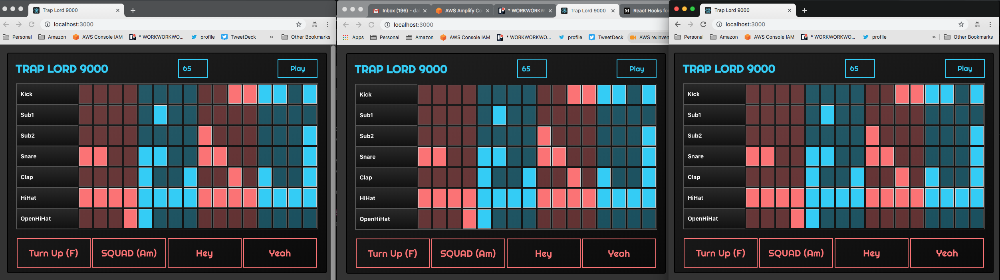
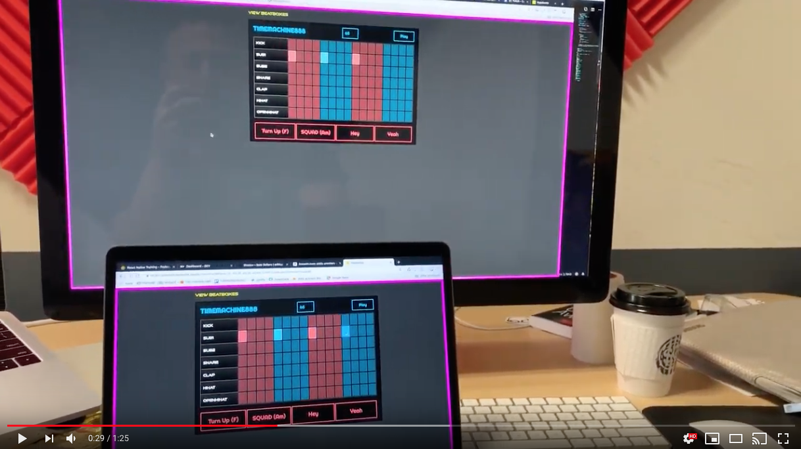

# Hype Beats



This is a fork of [hooks-drum-machine](https://github.com/kenwheeler/hooks-drum-machine) by Ken Wheeler, implemented with GraphQL subscriptions so you can collaborate on your next fire solo album.

> Click [here](https://www.hypebeats.dev/#/) to view the demo.

[](https://www.youtube.com/watch?v=nm2kt3h1--c)

## To deploy this app - Amplify Console

Deploy the full stack to the Amplify Console:

[](https://console.aws.amazon.com/amplify/home#/deploy?repo=https://github.com/dabit3/hype-beats)

## To run locally - Amplify CLI

1. Clone the repo

2. Initialize the project

```sh
amplify init

amplify push
```

3. Start the app

```sh
npm start
```
